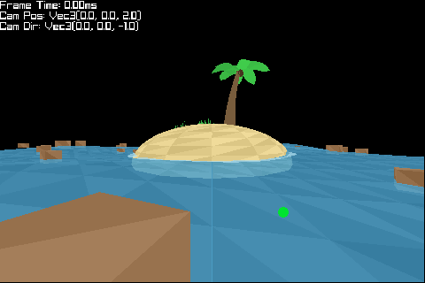
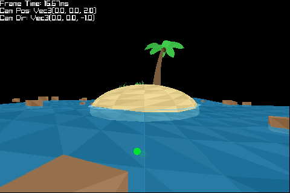

# software-renderer-rs
A CPU software renderer in Rust (raylib window/input, custom rasterization pipeline).

## Preview
### GIF


### Still


## Features
- CPU triangle rasterization with z-buffering.
- Clip-space triangle clipping and perspective-correct interpolation.
- Procedural low-poly scene elements:
  - Sandy island/hill mesh.
  - Animated water plane with wave deformation.
  - Animated foam ring around the island.
  - Procedural palm tree and grass patches.
  - Floating crates with bobbing motion.
- BVH acceleration structure with raycasts (used for scene placement).
- Fixed-step simulation (`60 FPS`) for stable animation timing.
- Optional media capture mode to export preview GIF + screenshot.

## Controls
- `W/A/S/D`: move camera
- `Space`: move up
- `Left Shift`: move down
- `Q/E`: yaw left/right
- `Esc`: quit

## Run
```bash
cargo run
```

## Capture Preview Media
```bash
cargo run -- --capture-demo
```

This generates:
- `assets/preview.gif` (1 second)
- `assets/screenshot.png`

## Project Timeline
- Initial repo commit: `2023-07-26`
- Bulk of active development: `2026-02-09`

Bulk date was derived from git history by commit count and total line churn (adds + deletes), where `2026-02-09` is the top day.
